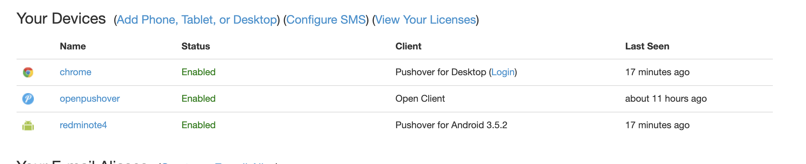
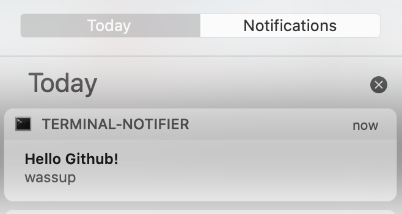

<div align="center">
<h2>OpenPushOver</h2> 
<p>multiplatform Pushover alerts notifier client</p>


</div>

---

### Features

* Inbuilt Pushover Go client 
* Supports proxys
* Supports basic end to end encryption
* Supports multiple pushover accounts
* notifications popup for different platforms 

---

### Requirements


* Linux
    - GNU/Linux only
    - `libnotify` (GNU/Linux) for notifications


* Macos 
    - `terminal-notifier` for notifications


* Windows
    - Notification isn't implemented only logs the alerts

---

### Installation

1. Install [golang](https://golang.org/) 

2. Get and Install the binary

```sh
go get github.com/itsjwala/OpenPushOver
```

---

### Usage

```sh
$HOME/go/bin/OpenPushOver -config config.json
```

### Sample Config

- You need to create the cache directory

- CheckSeconds can not be less than 5 seconds and defaults to 5 seconds if set to anything less.

- Default configuration file is located in the same directory as the exec however can be overridden using the -config flag.

- Key should be what you intend to use to receive encrypted messages and should obviously be the same on both ends.

```txt
{
    "Globals": {
        "CacheDir" : "./cache",
        "DeviceName": "openpushover", // new device will be registered with this name
        "CheckSeconds": 5 // poll every 5 seconds
    },
    "Proxys": [
        {
            "Name": "Tor",
            "Type": "socks5",
            "Address": "127.0.0.1:9050",
            "Username": "",
            "Password": "",
            "Timeout": 1
        }
    ],
    "Accounts": [
        {
            "DeviceUUID": "", //keep this empty if want to register new device
            "Username": "email",
            "Password": "password",
            "Key": "testkey123456789",
            "Proxy": "Tor"
        }
    ]
}
```

---

### Screenshots

Device registered `openpushover`



Notification popup



logline


> This is fork of `TheCreeper/OpenPushOver` with few modifications
